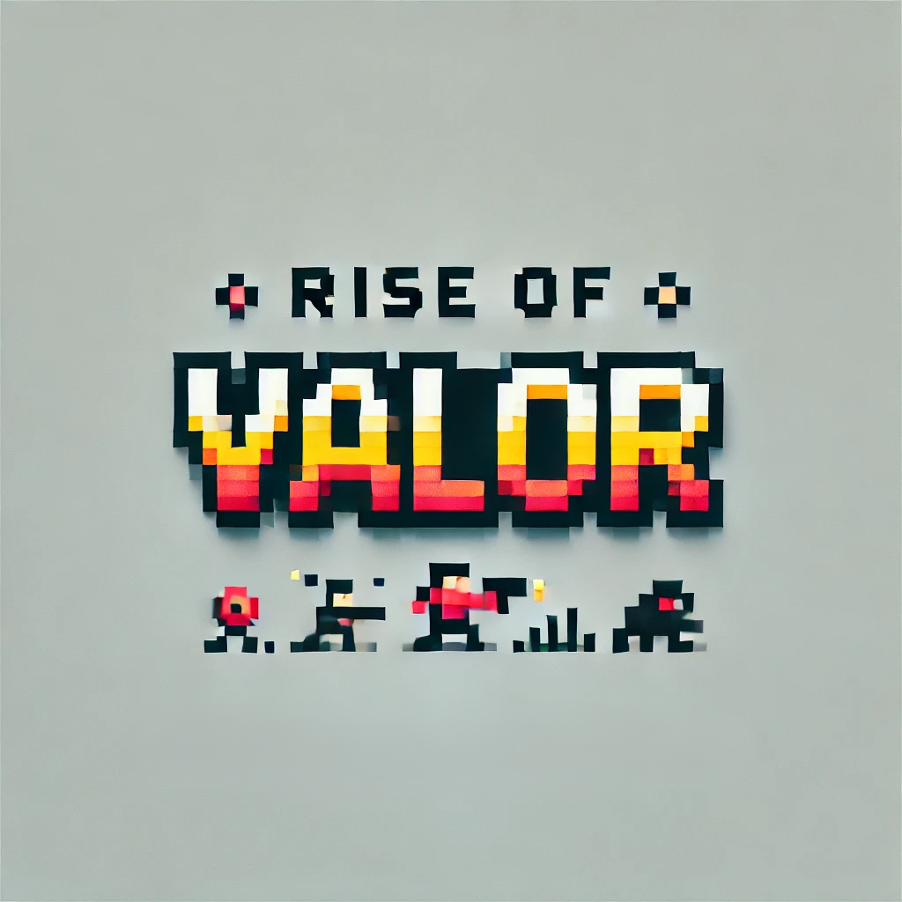

# Rise of Valor



> *A multiplayer pixel-art action game where teamwork meets survival.*

## 🎮 About the Game

**Rise of Valor** is an epic multiplayer pixel-art action game designed for 4-5 players who team up to battle relentless waves of enemies in intense co-op survival mode. Combining retro-inspired graphics with modern multiplayer mechanics, the game delivers fast-paced gameplay that emphasizes strategic teamwork, communication, and tactical combat.

Players must coordinate their attacks, manage resources, and survive increasingly challenging enemy waves while earning coins, leveling up, and unlocking new content. The game features a comprehensive progression system, customizable profiles, and an integrated shop system.

### ✨ Key Features

- **🌟 Multiplayer Co-op Survival**: Team up with 4-5 players in epic survival battles
- **🎨 Retro Pixel Art Style**: Beautiful hand-crafted sprites and animations
- **💬 Real-time Messaging**: Communicate with your team through in-game chat
- **🔊 Immersive Audio**: Rich soundscape with 78+ audio files including music and sound effects
- **🏪 In-Game Shop System**: Purchase upgrades, weapons, and cosmetics
- **👤 Player Progression**: Level up your character and unlock new abilities
- **🎯 Weapon System**: Multiple weapons with different damage and fire rates
- **💰 Coin Economy**: Earn and spend coins on upgrades and customizations
- **🎭 Character Customization**: Personalize your player profile and appearance
- **⚙️ Flexible Settings**: Customize audio, graphics, and gameplay settings
- **🖥️ Server Management**: Built-in server hosting and connection management

## 🏗️ Architecture Overview

Rise of Valor is built using **Java 21** and **JavaFX 21**, featuring a robust client-server architecture:

### Client-Server Architecture
```
┌─────────────────┐    Network     ┌─────────────────┐
│                 │◄──────────────►│                 │
│   Game Client   │   (Sockets)    │   Game Server   │
│                 │                │                 │
└─────────────────┘                └─────────────────┘
```

### Core Components

- **🎮 Game Engine**: Real-time rendering, physics, and collision detection
- **🌐 Networking Layer**: TCP socket communication between clients and server
- **🎵 Sound Manager**: Background music and sound effects management
- **🗺️ Map Manager**: World rendering and camera management
- **⚔️ Combat System**: Weapons, bullets, and damage mechanics
- **👾 Enemy AI**: Intelligent enemy behavior and spawn management
- **📊 Data Management**: Player statistics, game state, and persistence

## 📁 Project Structure

```
src/
├── main/java/game/rise_of_valor/
│   ├── Main.java                    # Application entry point
│   ├── controllers/                 # UI Controllers (23 classes)
│   │   ├── GamePlayController.java     # Main gameplay screen
│   │   ├── LobbyViewController.java    # Multiplayer lobby
│   │   ├── MessageViewController.java  # In-game messaging
│   │   ├── ShopController.java         # In-game shop
│   │   └── ...                        # Other UI controllers
│   ├── models/                      # Game Entity Models
│   │   ├── Player.java                 # Player character
│   │   ├── Enemy.java                  # Enemy entities
│   │   ├── Bullet.java                 # Projectile system
│   │   ├── Gun.java                    # Weapon system
│   │   └── ...                        # Other game models
│   ├── game_engine/                 # Core Game Engine
│   │   ├── GameWorld.java             # Single-player game world
│   │   ├── GameWorldMultiplayer.java  # Multiplayer game world
│   │   ├── SoundManager.java          # Audio management
│   │   ├── MapManager.java            # World and camera
│   │   └── ...                        # Other engine components
│   ├── network/                     # Networking Layer
│   │   ├── client/                    # Client-side networking
│   │   │   ├── Client.java               # Main client class
│   │   │   ├── ClientSenderThread.java   # Outbound communication
│   │   │   └── ClientReceiverThread.java # Inbound communication
│   │   └── server/                    # Server-side networking
│   │       ├── GameServer.java           # Main server class
│   │       ├── ClientHandler.java        # Per-client handler
│   │       └── ...                      # Server components
│   ├── effects/                     # Visual Effects
│   │   ├── DeathEffect.java           # Death animations
│   │   └── PortalEffect.java          # Portal animations
│   ├── utils/                       # Utility Classes
│   │   ├── CustomFont.java            # Font management
│   │   └── LoadSprite.java            # Sprite loading
│   └── shareData/                   # Shared Data Management
│       ├── UserData.java              # User information
│       ├── DataManager.java           # Global data
│       └── GameCache.java             # Game state cache
└── main/resources/
    └── game/rise_of_valor/
        ├── fxml/                    # UI Layouts (27 FXML files)
        ├── css/                     # Stylesheets
        └── assets/
            ├── images/              # Game graphics (209+ files)
            ├── sounds/              # Audio files (78+ files)
            ├── effects/             # Effect animations
            └── profile/             # Profile images
```

## 🚀 Getting Started

### Prerequisites

- **Java 21** or higher
- **Maven 3.6+**
- **JavaFX 21** (included via Maven dependencies)
- **Network connectivity** for multiplayer features

### Installation

1. **Clone the repository**
   ```bash
   git clone https://github.com/0xFaysal/Rise-of-Valor.git
   cd Rise-of-Valor
   ```

2. **Build the project**
   ```bash
   mvn clean compile
   ```

3. **Run the application**
   ```bash
   mvn javafx:run
   ```

### Alternative: Manual Execution

If you prefer to run with Java directly:

```bash
# Compile
mvn clean package

# Run with module path
java --module-path target/classes:/path/to/javafx/libs \
     --add-modules javafx.controls,javafx.fxml,javafx.media \
     -cp target/classes \
     game.rise_of_valor.Main
```

## 🎯 How to Play

### 1. **Starting a Game**

**Single Player Mode:**
- Launch the application
- Select "Single Player" from the main menu
- Choose your character and start playing

**Multiplayer Mode:**
- **Host a Game:**
  - Select "Host Game" from the main menu
  - Configure server settings
  - Share your IP address with friends
  - Wait for players to connect

- **Join a Game:**
  - Select "Join Game" from the main menu
  - Enter the host's IP address and port
  - Connect to the game session

### 2. **Gameplay Controls**

- **Movement**: WASD or Arrow Keys
- **Aim**: Mouse cursor
- **Shoot**: Left mouse button
- **Chat**: Enter key (in multiplayer)
- **Pause**: ESC key

### 3. **Game Objectives**

- **Survive** waves of increasingly difficult enemies
- **Collect coins** dropped by defeated enemies
- **Upgrade weapons** and abilities in the shop
- **Coordinate** with teammates for maximum effectiveness
- **Achieve high scores** and unlock new content

### 4. **Progression System**

- **Experience Points**: Gain XP by defeating enemies
- **Levels**: Increase your character level to unlock new features
- **Coins**: Currency for purchasing upgrades and cosmetics
- **Achievements**: Complete challenges for rewards

## 🛠️ Development

### Building from Source

```bash
# Clean and compile
mvn clean compile

# Run tests (if available)
mvn test

# Package application
mvn package

# Generate documentation
mvn javadoc:javadoc
```

### Development Environment Setup

1. **IDE Configuration**
   - Import as Maven project
   - Set Java SDK to version 21
   - Configure JavaFX runtime arguments

2. **Required VM Arguments** (for development)
   ```
   --module-path /path/to/javafx/lib
   --add-modules javafx.controls,javafx.fxml,javafx.media
   ```

### Code Style

- Follow standard Java naming conventions
- Use meaningful variable and method names
- Document public APIs with JavaDoc
- Maintain consistent indentation (4 spaces)

## 🌐 Multiplayer Setup

### Server Configuration

1. **Hosting a Server**
   ```bash
   # Default port: 1234
   # Ensure firewall allows incoming connections
   # Share your public IP with players
   ```

2. **Network Requirements**
   - **Port**: 1234 (default, configurable)
   - **Protocol**: TCP
   - **Players**: 2-5 per session
   - **Bandwidth**: Minimal (text and game state updates)

3. **Connection Process**
   - Server displays local IP address
   - Clients connect using server IP and port
   - Real-time synchronization of game state
   - Automatic reconnection on network issues

## 🎨 Asset Information

### Graphics
- **Total Images**: 209+ files
- **Formats**: PNG, JPEG
- **Style**: 16-bit pixel art
- **Categories**: Characters, weapons, environments, UI elements

### Audio
- **Total Audio Files**: 78+ files
- **Formats**: OGG, MP3
- **Categories**: 
  - Background music for different scenes
  - Sound effects (shooting, explosions, pickups)
  - UI interaction sounds
  - Victory/defeat audio

### Fonts
- Custom pixel-style fonts for UI consistency
- Multiple font weights and sizes

## 🤝 Contributing

We welcome contributions to improve Rise of Valor! Here's how you can help:

### Getting Started

1. **Fork the repository**
   ```bash
   git fork https://github.com/0xFaysal/Rise-of-Valor.git
   ```

2. **Create a feature branch**
   ```bash
   git checkout -b feature/your-feature-name
   ```

3. **Make your changes**
   - Follow the existing code style
   - Add tests for new functionality
   - Update documentation as needed

4. **Test thoroughly**
   ```bash
   mvn clean compile
   mvn test  # if tests exist
   # Test both single-player and multiplayer modes
   ```

5. **Submit a pull request**
   - Provide a clear description of your changes
   - Reference any relevant issues
   - Include screenshots for UI changes

### Development Guidelines

- **Code Quality**: Maintain high code standards
- **Performance**: Optimize for smooth 60 FPS gameplay
- **Compatibility**: Ensure cross-platform functionality
- **Security**: Validate all network inputs
- **Documentation**: Update README and inline comments

### Areas for Contribution

- 🐛 **Bug Fixes**: Report and fix gameplay issues
- ✨ **New Features**: Add weapons, enemies, or game modes
- 🎨 **Art Assets**: Create new sprites and animations
- 🔊 **Audio**: Compose music or create sound effects
- 🌐 **Networking**: Improve multiplayer stability
- 📱 **UI/UX**: Enhance user interface design
- 🧪 **Testing**: Add unit and integration tests
- 📚 **Documentation**: Improve guides and tutorials

## 📝 License

This project is licensed under the **MIT License**. See the [LICENSE](LICENSE) file for details.

## 🙏 Acknowledgments

- **JavaFX Community** for the excellent UI framework
- **Pixel Art Artists** who inspired the visual style
- **Open Source Audio** contributors for sound resources
- **Beta Testers** who provided valuable feedback

## 📧 Contact & Support

- **Project Maintainer**: 0xFaysal
- **Repository**: [https://github.com/0xFaysal/Rise-of-Valor](https://github.com/0xFaysal/Rise-of-Valor)
- **Issues**: Report bugs and request features via GitHub Issues
- **Discussions**: Use GitHub Discussions for general questions

## 🗺️ Roadmap

### Upcoming Features
- [ ] **Enhanced AI**: Smarter enemy behaviors and tactics
- [ ] **New Weapons**: Additional weapon types and upgrades
- [ ] **Map Editor**: Create custom battle arenas
- [ ] **Achievements System**: Unlock rewards for accomplishments
- [ ] **Leaderboards**: Global and friends ranking systems
- [ ] **Mobile Support**: Android/iOS compatibility
- [ ] **Mod Support**: Plugin system for community content

### Version History
- **v1.0.0**: Initial release with core multiplayer functionality
- **Current**: Active development with regular updates

---

*Ready to prove your valor? Download, build, and join the battle today!*